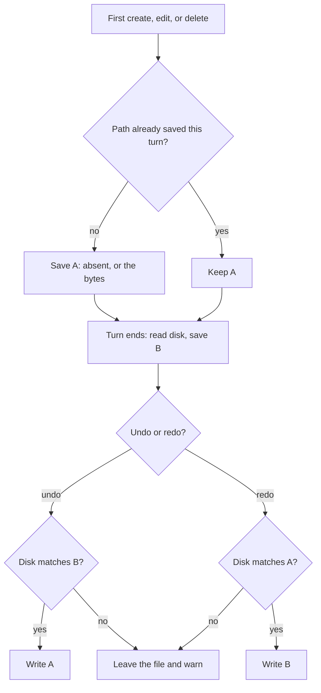

# Turn checkpoints

Each turn stores two states per file it changes. State A is the file before the turn. State B is the file after the turn. Undo and redo move between those two states. They do not replay each tool call.

Tool diffs are a separate store. `write`, `edit`, `delete`, and `apply_patch` still save their own `files/{callId}.before` and `files/{callId}.after` bytes for the chat UI. Those files are never used for undo or redo.

## When a file is recorded

A file is recorded the first time a turn is about to create it, edit it, or delete it. Later touches of that same path in the same turn do not save another before copy.

| Operation | State A                                             |
| --------- | --------------------------------------------------- |
| Create    | The path did not exist. No before bytes are stored. |
| Edit      | The file bytes from before the first edit.          |
| Delete    | The file bytes from before the delete.              |

Directories are ignored. `bash` is ignored. A nested task turn is not part of the parent checkpoint. A missing file is not an empty file. An empty file exists and its hash is the hash of zero bytes.

## End of the turn

When the turn finishes, each recorded path is read once more.

| Disk at the end | State B                            |
| --------------- | ---------------------------------- |
| File exists     | Those bytes.                       |
| Path is gone    | Absent. No after bytes are stored. |

Bytes live under `sessions/{sessionId}/checkpoints/{checkpointId}/`. The session record stores only the path, the two hashes, the turn id, and the checkpoint id.

## Undo and redo

Undo restores A only when the current path matches B. Redo restores B only when the current path matches A. Match means the same bytes, or the same absence.

| Current path                        | Undo                                | Redo                                |
| ----------------------------------- | ----------------------------------- | ----------------------------------- |
| Matches the state being left        | Restore the other state.            | Restore the other state.            |
| Differs, including exists vs absent | Leave the file. Warn with the path. | Leave the file. Warn with the path. |

One file failing does not block the other files. The chat still moves. A warned path stays as it is.

Rewinding several turns uses the oldest A and the newest B for each path. Redo uses that same pair in the other direction.
