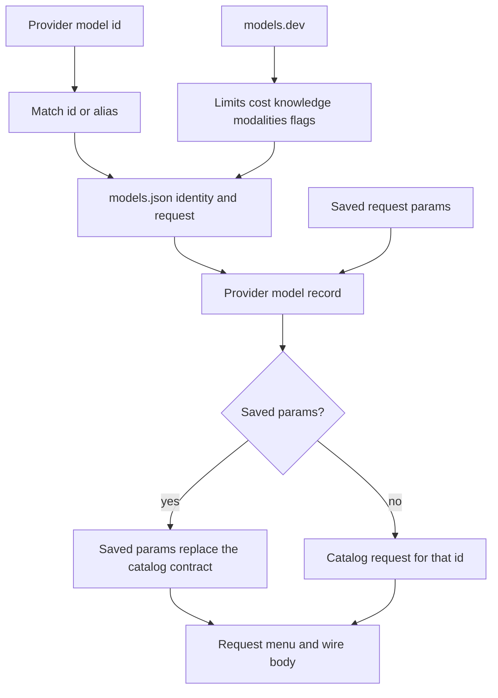

# Model catalog

Three sources. Each one has one job.

`src-tauri/catalog/models.json` is the list of models the app knows. A provider model id is matched there by id or alias. That file also holds the wire contract (`request`) when one is known.

models.dev (`https://models.dev/api.json`) refreshes facts that go stale: context limit, max output, price, knowledge cutoff, input and output modalities, and capability flags. It does not add models. It does not replace `request`.

Settings stores `request.params` on a provider model. Each param has a name, a type (`string`, `number`, or `bool`), and comma-separated values. Bool has no value list. If any param is saved, that list replaces the catalog contract for that model. Those params show in the request menu and are sent. Clear every param and the catalog contract is used again. A bad value fails at the provider.

`thinking`, `effort`, `temperature`, `serviceTier`, and `reasoningSplit` map onto the existing request controls. Any other saved name is an extra field on the wire body.

The edit dialog has two sections. The first is the shared model record (id, name, family, context, output, modalities, flags, cost), filled from the catalog after the models.dev refresh. The second is the param list. With no saved params, that list is seeded from the catalog `request` for the model id. A `known: false` request seeds an empty list.

Every catalog entry has a `request` object. `known` and `native` are always present. Extra fields (`reasoning`, `sampling`, `tiers`, `tokenField`, `reasoningSplitOpenai`) appear only when that wire is verified.

`known: true` is sent when the provider kind matches a protocol in `native` (`openai` for openai-like, `anthropic` for anthropic-like, `gemini` for gemini-like) on any base URL, or when the host is MiniMax, OpenAI, Anthropic, or Gemini and `native` names that host. `known: false` stays in the catalog and is not sent. MiniMax contracts list `minimax`, `openai`, and `anthropic`, so both MiniMax wires work on any host that speaks one of those protocols.

## Catalog snapshot

Refreshed on 2026-10-03
